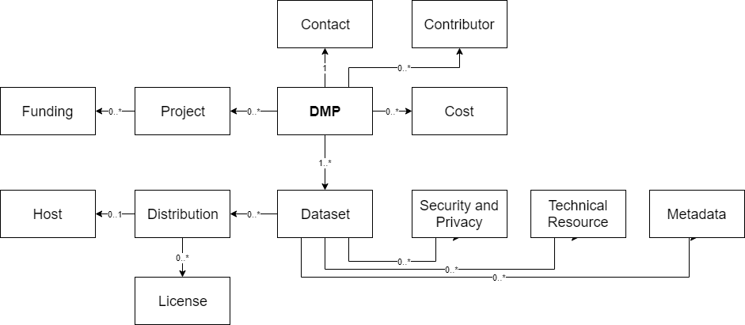

# Plan de Gestión de Datos (PGD) Data Management Plan (DMP) / Borrador /

<table>
<tr>
<td valign="top">
<h3>Acerca de este documento / Borrador / </h3>

Este es un perfil / Borrador / para proporcionar interoperabilidad básica entre sistemas que producen o consumen planes de gestión de datos accionables por máquina (maPGDs). Se pueden agregar campos adicionales en implementaciones específicas, pero no garantizan la interoperabilidad. Las herramientas de PGD pueden usar otros campos en sus modelos de datos internos.

Este perfil de aplicación está destinado a cubrir una amplia gama de casos de uso y no establece ningún requisito comercial específico (por ejemplo, requisitos específicos del financiador). Representa información durante todo el ciclo de vida del PGD.

Para más información, vea <a href="https://github.com/RDA-DMP-Common/RDA-DMP-Common-Standard/tree/master/examples/JSON">ejemplos</a>, <a href="https://github.com/RDA-DMP-Common/RDA-DMP-Common-Standard/blob/master/docs/FAQ.md">preguntas frecuentes</a> y <a href="https://github.com/RDA-DMP-Common/RDA-DMP-Common-Standard/blob/master/docs/links.md">enlaces útiles a consultas, documentos, herramientas, prototipos, etc.</a> desarrollados por el grupo de trabajo.

<h3>DMP</h3>

Proporciona información de alto nivel sobre el PGD, por ejemplo, su título, fecha de modificación, etc. Es la raíz de este perfil de aplicación. La mayoría de sus campos son obligatorios.

<h3>Proyecto</h3>

Describe el proyecto asociado con el PGD, si corresponde. Puede usarse para describir cualquier tipo de proyecto: no solo proyectos financiados, sino también proyectos internos, tesis de doctorado, etc.

<h3>Financiación</h3>

Para especificar detalles sobre proyectos financiados, por ejemplo, proyectos financiados por la NSF o la CE.

<h3>Contacto</h3>

Especifica la parte que puede proporcionar cualquier información sobre el PGD. Esta no es necesariamente la persona que creó el PGD y puede ser una persona u organización.

<h3>Colaborador</h3>

Para enumerar todas las partes involucradas en el proceso de gestión de datos descrito por este PGD y aquellas partes involucradas en la creación y gestión del propio PGD.

<h3>Costo</h3>

Proporciona una lista de costos relacionados con la gestión de datos.

<h3>Conjunto de datos</h3>

Sigue la definición de Conjunto de datos en la especificación W3C DCAT. El Conjunto de datos puede entenderse como una entidad lógica que describe datos, por ejemplo, datos sin procesar. Proporciona información de alto nivel sobre los datos. La granularidad del conjunto de datos depende de un entorno específico. En casos límite, puede ser un archivo, pero también una colección de archivos en diferentes formatos. Vea <a href="https://github.com/RDA-DMP-Common/RDA-DMP-Common-Standard/blob/master/docs/FAQ.md">FAQ</a> para más detalles.

<h3>Distribución</h3>

El término "distribución" se utiliza aquí como se define en el perfil de aplicación de metadatos W3C DCAT, ampliamente utilizado. Se utiliza para referirse a una instancia particular de un conjunto de datos que ha sido, o se pretende que sea, puesto a disposición de alguna manera. Es importante separar la noción lógica de un "conjunto de datos" de sus distribuciones, de las cuales puede haber varias, especialmente para adjuntar propiedades de metadatos más específicas, como "tamaño" y "licencia". El ciclo de vida del PGD no tiene una incidencia particular en esto, y se puede definir una "distribución" incluso si el PGD nunca se lleva a cabo realmente.

<h3>Licencia</h3>

Se utiliza para indicar la licencia bajo la cual se pondrán a disposición los datos (cada Distribución específica). También permite modelar embargos. Vea <a href="https://github.com/RDA-DMP-Common/RDA-DMP-Common-Standard/blob/master/docs/FAQ.md">FAQ</a> para más detalles.

<h3>Alojamiento</h3>

Proporciona información sobre el sistema donde se almacenan los datos. Se puede utilizar para proporcionar detalles sobre un repositorio donde se depositan los datos, por ejemplo, un repositorio certificado por Core Trust Seal ubicado en Europa que utiliza DOIs. También puede proporcionar detalles sobre sistemas donde se almacenan y procesan los datos durante la investigación, por ejemplo, un ordenador de alto rendimiento que utiliza almacenamiento rápido con dos copias de seguridad diarias.

<h3>Seguridad y Privacidad</h3>

Se utiliza para indicar cualquier requisito específico relacionado con la seguridad y privacidad de un conjunto de datos específico, por ejemplo, para indicar que los datos no están anonimizados.

<h3>Recurso Técnico</h3>

Para especificar equipos necesarios/utilizados para crear o procesar los datos, por ejemplo, un microscopio, etc.

<h3>Metadatos</h3>

Proporciona un puntero a un estándar de metadatos utilizado para describir los datos. No contiene metadatos reales relacionados con el conjunto de datos.

</td>
<td valign="top">
<h3>Estructura</h3>
<ul>
<li id="dmp_tree"><a href="#dmp_table">dmp</a></li>
<ul>
<li id="dmp_contact_tree"><a href="#dmp_contact_table">contacto / contact</a></li>
<ul>
<li id="contact_id_tree"><a href="#contact_id_table">contacto_id / contact_id</a></li>
<ul>
<li id="contact_id_identifier_tree"><a href="#contact_id_identifier">identificador / identifier</a></li>
<li id="contact_id_type_tree"><a href="#contact_id_type">tipo / type</a></li>
</ul>
<li id="dmp_contact_mbox_tree"><a href="#dmp_contact_mbox">correo / mbox</a></li>
<li id="dmp_contact_name_tree"><a href="#dmp_contact_name">nombre / name</a></li>
</ul>
<li id="dmp_contributor_tree"><a href="#dmp_contributor_table">colaborador / contributor</a></li>
<ul>
<li id="contributor_id_tree"><a href="#contributor_id_table">colaborador_id / contributor_id</a></li>
<ul>
<li id="contributor_id_id_tree"><a href="#contributor_id_id">identificador / identifier</a></li>
<li id="contributor_id_type_tree"><a href="#contributor_id_type">tipo / type</a></li>
</ul>
<li id="dmp_contributor_mbox_tree"><a href="#dmp_contributor_mbox">correo / mbox</a></li>
<li id="dmp_contributor_name_tree"><a href="#dmp_contributor_name">nombre / name</a></li>
<li id="dmp_contributor_role_tree"><a href="#dmp_contributor_role">rol / role</a></li>
</ul>
<li id="cost_tree"><a href="#cost_table">costo / cost</a></li>
<ul>
<li id="cost_unit_tree"><a href="#cost_unit">moneda / currency_code</a></li>
<li id="cost_description_tree"><a href="#cost_description">descripción / description</a></li>
<li id="cost_title_tree"><a href="#cost_title">título / title</a></li>
<li id="cost_value_tree"><a href="#cost_value">valor / value</a></li>
</ul>
<li id="dmp_created_tree"><a href="#dmp_created">creado / created</a></li>
<li id="dataset_tree"><a href="#dataset_table">conjunto de datos / dataset</a></li>
<ul>
<li id="dataset_quality_assurance_tree"><a href="#dataset_quality_assurance">aseguramiento de calidad / data_quality_assurance</a></li>
<li id="dataset_id_tree"><a href="#dataset_id_table">conjunto de datos_id / dataset_id</a></li>
<ul>
<li id="dataset_id_id_tree"><a href="#dataset_id_id">identificador / identifier</a></li>
<li id="dataset_id_type_tree"><a href="#dataset_id_type">tipo / type</a></li>
</ul>
<li id="dataset_description_tree"><a href="#dataset_description">descripción / description</a></li>
<li id="distribution_tree"><a href="#distribution_table">distribución / distribution</a></li>
<ul>
<li id="distribution_access_url_tree"><a href="#distribution_access_url">url de acceso / access_url</a></li>
<li id="distribution_available_until_tree"><a href="#distribution_available_until">disponible hasta / available_until</a></li>
<li id="distribution_byte_size_tree"><a href="#distribution_byte_size">tamaño en bytes / byte_size</a></li>
<li id="distribution_data_access_tree"><a href="#distribution_data_access">acceso a datos / data_access</a></li>
<li id="distribution_description_tree"><a href="#distribution_description">descripción / description</a></li>
<li id="distribution_download_url_tree"><a href="#distribution_download_url">url de descarga / download_url</a></li>
<li id="distribution_format_tree"><a href="#distribution_format">formato / format</a></li>
<li id="host_tree"><a href="#host_table">alojamiento / host</a></li>
<ul>
<li id="host_availability_tree"><a href="#host_availability">disponibilidad / availability</a></li>
<li id="host_backup_frequency_tree"><a href="#host_backup_frequency">frecuencia de respaldo / backup_frequency</a></li>
<li id="host_backup_type_tree"><a href="#host_backup_type">tipo de respaldo / backup_type</a></li>
<li id="host_certified_with_tree"><a href="#host_certified_with">certificado con / certified_with</a></li>
<li id="host_description_tree"><a href="#host_description">descripción / description</a></li>
<li id="host_geo_location_tree"><a href="#host_geo_location">ubicación geográfica / geo_location</a></li>
<li id="host_pid_system_tree"><a href="#host_pid_system">sistema de identificador persistente / pid_system</a></li>
<li id="host_storage_type_tree"><a href="#host_storage_type">tipo de almacenamiento / storage_type</a></li>
<li id="host_supports_versioning_tree"><a href="#host_supports_versioning">soporta versionado / supports_versioning</a></li>
<li id="host_title_tree"><a href="#host_title">título / title</a></li>
<li id="host_url_tree"><a href="#host_url">url</a></li>
</ul>
<li id="license_tree"><a href="#license_table">licencia / license</a></li>
<ul>
<li id="license_ref_tree"><a href="#license_ref">referencia de licencia / license_ref</a></li>
<li id="license_start_date_tree"><a href="#license_start_date">fecha de inicio / start_date</a></li>
</ul>
<li id="distribution_title_tree"><a href="#distribution_title">título / title</a></li>
</ul>
<li id="dataset_issued_tree"><a href="#dataset_issued">emitido / issued</a></li>
<li id="dataset_keyword_tree"><a href="#dataset_keyword">palabra clave / keyword</a></li>
<li id="dataset_language_tree"><a href="#dataset_language">idioma / language</a></li>
<li id="metadata_tree"><a href="#metadata_table">metadatos / metadata</a></li>
<ul>
<li id="metadata_description_tree"><a href="#metadata_description">descripción / description</a></li>
<li id="metadata_language_tree"><a href="#metadata_language">idioma / language</a></li>
<li id="metadata_standard_id_tree"><a href="#metadata_standard_id_table">identificador de estándar de metadatos / metadata_standard_id</a></li>
<ul>
<li id="metadata_id_id_tree"><a href="#metadata_id_id">identificador / identifier</a></li>
<li id="metadata_id_type_tree"><a href="#metadata_id_type">tipo / type</a></li>
</ul>
</ul>
<li id="dataset_personal_data_tree"><a href="#dataset_personal_data">datos personales / personal_data</a></li>
<li id="dataset_preservation_tree"><a href="#dataset_preservation">declaración de preservación / preservation_statement</a></li>
<li id="security_privacy_tree"><a href="#security_privacy_table">seguridad y privacidad / security_and_privacy</a></li>
<ul>
<li id="sp_description_tree"><a href="#sp_description">descripción / description</a></li>
<li id="sp_title_tree"><a href="#sp_title">título / title</a></li>
</ul>
<li id="dataset_sensitive_data_tree"><a href="#dataset_sensitive_data">datos sensibles / sensitive_data</a></li>
<li id="technical_resource_tree"><a href="#technical_resource_table">recurso técnico / technical_resource</a></li>
<ul>
<li id="technical_resource_description_tree"><a href="#technical_resource_description">descripción / description</a></li>
<li id="technical_resource_name_tree"><a href="#technical_resource_name">nombre / name</a></li>
</ul>
<li id="dataset_title_tree"><a href="#dataset_title">título / title</a></li>
<li id="dataset_type_tree"><a href="#dataset_type">tipo / type</a></li>
</ul>
<li id="dmp_description_tree"><a href="#dmp_description">descripción / description</a></li>
<li id="dmp_id_tree"><a href="#dmp_id_table">dmp_id</a></li>
<ul>
<li id="dmp_id_id_tree"><a href="#dmp_id_id">identificador / identifier</a></li>
<li id="dmp_id_type_tree"><a href="#dmp_id_type">tipo / type</a></li>
</ul>
<li id="ethical_issues_description_tree"><a href="#ethical_issues_description">descripción de cuestiones éticas / ethical_issues_description</a></li>
<li id="ethical_issues_exist_tree"><a href="#ethical_issues_exist">cuestiones éticas existen / ethical_issues_exist</a></li>
<li id="ethical_issues_report_tree"><a href="#ethical_issues_report">informe de cuestiones éticas / ethical_issues_report</a></li>
<li id="dmp_language_tree"><a href="#dmp_language">idioma / language</a></li>
<li id="dmp_modified_tree"><a href="#dmp_modified">modificado / modified</a></li>
<li id="project_tree"><a href="#project_table">proyecto / project</a></li>
<ul>
<li id="project_description_tree"><a href="#project_description">descripción / description</a></li>
<li id="project_end_tree"><a href="#project_end">fin / end</a></li>
<li id="funding_tree"><a href="#funding_table">financiación / funding</a></li>
<ul>
<li id="funder_id_tree"><a href="#funder_id_table">identificador de financiador / funder_id</a></li>
<ul>
<li id="funder_id_id_tree"><a href="#funder_id_id">identificador / identifier</a></li>
<li id="funder_id_type_tree"><a href="#funder_id_type">tipo / type</a></li>
</ul>
<li id="funding_status_tree"><a href="#funding_status">estado de financiación / funding_status</a></li>
<li id="grant_id_tree"><a href="#grant_id_table">identificador de subvención / grant_id</a></li>
<ul>
<li id="grant_id_id_tree"><a href="#grant_id_id">identificador / identifier</a></li>
<li id="grant_id_type_tree"><a href="#grant_id_type">tipo / type</a></li>
</ul>
</ul>
<li id="project_start_tree"><a href="#project_start">inicio / start</a></li>
<li id="project_title_tree"><a href="#project_title">título / title</a></li>
</ul>
<li id="dmp_title_tree"><a href="#dmp_title">título / title</a></li>
</ul>
</td>
</tr>
</table>

<h2 id="dmp_contact_table">Propiedades en 'contacto / contact'</h2>

<table style="width: 99%;">
<thead>
<tr>
<th>Nombre</th>
<th>Descripción</th>
<th>Tipo de Datos</th>
<th>Cardinalidad</th>
<th>Valor de Ejemplo</th>
</tr>
</thead>
<tbody>
<tr>
<td valign="top"><a id="contact_id" href="#contact_id_tree">contacto_id / contact_id</a></td>
<td valign="top">Identificador para una persona de contacto</td>
<td valign="top">Estructura de Datos Anidada</td>
<td valign="top">1</td>
<td valign="top"> </td>
</tr>
<tr>
<td valign="top"><a id="dmp_contact_mbox" href="#dmp_contact_mbox_tree">correo / mbox</a></td>
<td valign="top">Dirección de correo electrónico</td>
<td valign="top">Cadena</td>
<td valign="top">1</td>
<td valign="top">cc@example.com</td>
</tr>
<tr>
<td valign="top"><a id="dmp_contact_name" href="#dmp_contact_name_tree">nombre / name</a></td>
<td valign="top">Nombre de la persona de contacto</td>
<td valign="top">Cadena</td>
<td valign="top">1</td>
<td valign="top">Charlie Chaplin</td>
</tr>
</tbody>
</table>

<h2 id="contact_id_table">Propiedades en 'contacto_id / contact_id'</h2>

<table style="width: 99%;">
<thead>
<tr>
<th>Nombre</th>
<th>Descripción</th>
<th>Tipo de Datos</th>
<th>Cardinalidad</th>
<th>Valor de Ejemplo</th>
</tr>
</thead>
<tbody>
<tr>
<td valign="top"><a id="contact_id_identifier" href="#contact_id_identifier_tree">identificador / identifier</a></td>
<td valign="top"> </td>
<td valign="top">Cadena</td>
<td valign="top">1</td>
<td valign="top"> </td>
</tr>
<tr>
<td valign="top"><a id="contact_id_type" href="#contact_id_type_tree">tipo / type</a></td>
<td valign="top">Tipo de identificador Valores permitidos:<ul><li>orcid</li><li>isni</li><li>openid</li><li>otro</li></ul></td>
<td valign="top">Término de Vocabulario Controlado</td>
<td valign="top">1</td>
<td valign="top">orcid</td>
</tr>
</tbody>
</table>

<h2 id="dmp_contributor_table">Propiedades en 'colaborador / contributor'</h2>

<table style="width: 99%;">
<thead>
<tr>
<th>Nombre</th>
<th>Descripción</th>
<th>Tipo de Datos</th>
<th>Cardinalidad</th>
<th>Valor de Ejemplo</th>
</tr>
</thead>
<tbody>
<tr>
<td valign="top"><a id="contributor_id" href="#contributor_id_tree">colaborador_id / contributor_id</a></td>
<td valign="top"> </td>
<td valign="top">Estructura de Datos Anidada</td>
<td valign="top">1</td>
<td valign="top"> </td>
</tr>
<tr>
<td valign="top"><a id="dmp_contributor_mbox" href="#dmp_contributor_mbox_tree">correo / mbox</a></td>
<td valign="top">Dirección de correo electrónico</td>
<td valign="top">Cadena</td>
<td valign="top">0..1</td>
<td valign="top">john@smith.com</td>
</tr>
<tr>
<td valign="top"><a id="dmp_contributor_name" href="#dmp_contributor_name_tree">nombre / name</a></td>
<td valign="top">Nombre</td>
<td valign="top">Cadena</td>
<td valign="top">1</td>
<td valign="top">John Smith</td>
</tr>
<tr>
<td valign="top"><a id="dmp_contributor_role" href="#dmp_contributor_role_tree">rol / role</a></td>
<td valign="top">Tipo de colaborador</td>
<td valign="top">Cadena</td>
<td valign="top">1..n</td>
<td valign="top">Administrador de Datos</td>
</tr>
</tbody>
</table>

<h2 id="contributor_id_table">Propiedades en 'colaborador_id / contributor_id'</h2>

<table style="width: 99%;">
<thead>
<tr>
<th>Nombre</th>
<th>Descripción</th>
<th>Tipo de Datos</th>
<th>Cardinalidad</th>
<th>Valor de Ejemplo</th>
</tr>
</thead>
<tbody>
<tr>
<td valign="top"><a id="contributor_id_id" href="#contributor_id_id_tree">identificador / identifier</a></td>
<td valign="top">Identificador para una persona de contacto</td>
<td valign="top">Cadena</td>
<td valign="top">1</td>
<td valign="top">http://orcid.org/0000-0000-0000-0000</td>
</tr>
<tr>
<td valign="top"><a id="contributor_id_type" href="#contributor_id_type_tree">tipo / type</a></td>
<td valign="top">Tipo de identificador Valores permitidos:<ul><li>orcid</li><li>isni</li><li>openid</li><li>otro</li></ul></td>
<td valign="top">Término de Vocabulario Controlado</td>
<td valign="top">1</td>
<td valign="top">orcid</td>
</tr>
</tbody>
</table>

<h2 id="cost_table">Propiedades en 'costo / cost'</h2>

<table style="width: 99%;">
<thead>
<tr>
<th>Nombre</th>
<th>Descripción</th>
<th>Tipo de Datos</th>
<th>Cardinalidad</th>
<th>Valor de Ejemplo</th>
</tr>
</thead>
<tbody>
<tr>
<td valign="top"><a id="cost_unit" href="#cost_unit_tree">moneda / currency_code</a></td>
<td valign="top">Valores permitidos definidos por ISO 4217.</td>
<td valign="top">Término de Vocabulario Controlado</td>
<td valign="top">0..1</td>
<td valign="top">EUR</td>
</tr>
<tr>
<td valign="top"><a id="cost_description" href="#cost_description_tree">descripción / description</a></td>
<td valign="top">Descripción</td>
<td valign="top">Cadena</td>
<td valign="top">0..1</td>
<td valign="top">Costos para mantener...</td>
</tr>
<tr>
<td valign="top"><a id="cost_title" href="#cost_title_tree">título / title</a></td>
<td valign="top">Título</td>
<td valign="top">Cadena</td>
<td valign="top">1</td>
<td valign="top">Almacenamiento y respaldo</td>
</tr>
<tr>
<td valign="top"><a id="cost_value" href="#cost_value_tree">valor / value</a></td>
<td valign="top">Valor</td>
<td valign="top">Número</td>
<td valign="top">0..1</td>
<td valign="top">1000</td>
</tr>
</tbody>
</table>

<h2 id="dataset_table">Propiedades en 'conjunto de datos / dataset'</h2>

<table style="width: 99%;">
<thead>
<tr>
<th>Nombre</th>
<th>Descripción</th>
<th>Tipo de Datos</th>
<th>Cardinalidad</th>
<th>Valor de Ejemplo</th>
</tr>
</thead>
<tbody>
<tr>
<td valign="top"><a id="dataset_quality_assurance" href="#dataset_quality_assurance_tree">aseguramiento de calidad / data_quality_assurance</a></td>
<td valign="top">Aseguramiento de la Calidad de los Datos</td>
<td valign="top">Cadena</td>
<td valign="top">0..n</td>
<td valign="top">Utilizamos convención de nombres de archivos...</td>
</tr>
<tr>
<td valign="top"><a id="dataset_id" href="#dataset_id_tree">conjunto de datos_id / dataset_id</a></td>
<td valign="top">ID del Conjunto de Datos</td>
<td valign="top">Estructura de Datos Anidada</td>
<td valign="top">1</td>
<td valign="top"> </td>
</tr>
<tr>
<td valign="top"><a id="dataset_description" href="#dataset_description_tree">descripción / description</a></td>
<td valign="top">Descripción es una propiedad en Conjunto de Datos y Distribución, en conformidad con W3C DCAT. En algunos casos, estas podrían ser idénticas, pero en la mayoría de los casos, el Conjunto de Datos representa un concepto más abstracto, mientras que la distribución puede apuntar a un archivo específico.</td>
<td valign="top">Cadena</td>
<td valign="top">0..1</td>
<td valign="top">Observación de campo</td>
</tr>
<tr>
<td valign="top"><a id="distribution" href="#distribution_tree">distribución / distribution</a></td>
<td valign="top">Para proporcionar información técnica sobre una instancia específica de datos.</td>
<td valign="top">Estructura de Datos Anidada</td>
<td valign="top">0..n</td>
<td valign="top"> </td>
</tr>
<tr>
<td valign="top"><a id="dataset_issued" href="#dataset_issued_tree">emitido / issued</a></td>
<td valign="top">Emitido. Codificado usando la cadena de fecha y hora relevante de ISO 8601 <a href="https://www.w3.org/TR/NOTE-datetime">compliant string</a></td>
<td valign="top">Fecha</td>
<td valign="top">0..1</td>
<td valign="top">2019-06-30</td>
</tr>
<tr>
<td valign="top"><a id="dataset_keyword" href="#dataset_keyword_tree">palabra clave / keyword</a></td>
<td valign="top">Palabra Clave</td>
<td valign="top">Cadena</td>
<td valign="top">0..n</td>
<td valign="top">palabra clave 1, palabra clave 2</td>
</tr>
<tr>
<td valign="top"><a id="dataset_language" href="#dataset_language_tree">idioma / language</a></td>
<td valign="top">Idioma del conjunto de datos expresado usando ISO 639-3</td>
<td valign="top">Término de Vocabulario Controlado</td>
<td valign="top">0..1</td>
<td valign="top">eng</td>
</tr>
<tr>
<td valign="top"><a id="metadata" href="#metadata_tree">metadatos / metadata</a></td>
<td valign="top">Para describir estándares de metadatos utilizados.</td>
<td valign="top">Estructura de Datos Anidada</td>
<td valign="top">0..n</td>
<td valign="top"> </td>
</tr>
<tr>
<td valign="top"><a id="dataset_personal_data" href="#dataset_personal_data_tree">datos personales / personal_data</a></td>
<td valign="top">Valores permitidos:<ul><li>sí</li><li>no</li><li>desconocido</li></ul></td>
<td valign="top">Término de Vocabulario Controlado</td>
<td valign="top">1</td>
<td valign="top">desconocido</td>
</tr>
<tr>
<td valign="top"><a id="dataset_preservation" href="#dataset_preservation_tree">declaración de preservación / preservation_statement</a></td>
<td valign="top">Declaración de Preservación</td>
<td valign="top">Cadena</td>
<td valign="top">0..1</td>
<td valign="top">Debe ser preservado para permitir...</td>
</tr>
<tr>
<td valign="top"><a id="security_privacy" href="#security_privacy_tree">seguridad y privacidad / security_and_privacy</a></td>
<td valign="top">Para listar todos los problemas y requisitos relacionados con la seguridad y la privacidad</td>
<td valign="top">Estructura de Datos Anidada</td>
<td valign="top">0..n</td>
<td valign="top"> </td>
</tr>
<tr>
<td valign="top"><a id="dataset_sensitive_data" href="#dataset_sensitive_data_tree">datos sensibles / sensitive_data</a></td>
<td valign="top">Valores permitidos:<ul><li>sí</li><li>no</li><li>desconocido</li></ul></td>
<td valign="top">Término de Vocabulario Controlado</td>
<td valign="top">1</td>
<td valign="top">desconocido</td>
</tr>
<tr>
<td valign="top"><a id="technical_resource" href="#technical_resource_tree">recurso técnico / technical_resource</a></td>
<td valign="top">Para enumerar todos los recursos técnicos necesarios para implementar un PGD</td>
<td valign="top">Estructura de Datos Anidada</td>
<td valign="top">0..n</td>
<td valign="top"> </td>
</tr>
<tr>
<td valign="top"><a id="dataset_title" href="#dataset_title_tree">título / title</a></td>
<td valign="top">Título es una propiedad tanto en Conjunto de Datos como en Distribución, en conformidad con W3C DCAT. En algunos casos, estos podrían ser idénticos, pero en la mayoría de los casos, el Conjunto de Datos representa un concepto más abstracto, mientras que la distribución puede apuntar a un archivo específico.</td>
<td valign="top">Cadena</td>
<td valign="top">1</td>
<td valign="top">Imágenes de autos rápidos</td>
</tr>
<tr>
<td valign="top"><a id="dataset_type" href="#dataset_type_tree">tipo / type</a></td>
<td valign="top">Si corresponde, tipo según: Diccionario de DataCite y/o COAR. De lo contrario, use el nombre común para el tipo, por ejemplo, datos sin procesar, software, encuesta, etc. https://schema.datacite.org/meta/kernel-4.1/doc/DataCite-MetadataKernel_v4.1.pdf
http://vocabularies.coar-repositories.org/pubby/resource_type.html</td>
<td valign="top">Cadena</td>
<td valign="top">0..1</td>
<td valign="top">imagen</td>
</tr>
</tbody>
</table>

<h2 id="dataset_id_table">Propiedades en 'conjunto de datos_id / dataset_id'</h2>

<table style="width: 99%;">
<thead>
<tr>
<th>Nombre</th>
<th>Descripción</th>
<th>Tipo de Datos</th>
<th>Cardinalidad</th>
<th>Valor de Ejemplo</th>
</tr>
</thead>
<tbody>
<tr>
<td valign="top"><a id="dataset_id_id" href="#dataset_id_id_tree">identificador / identifier</a></td>
<td valign="top">Identificador para un conjunto de datos</td>
<td valign="top">Cadena</td>
<td valign="top">1</td>
<td valign="top">https://hdl.handle.net/11353/10.923628</td>
</tr>
<tr>
<td valign="top"><a id="dataset_id_type" href="#dataset_id_type_tree">tipo / type</a></td>
<td valign="top">Tipo de identificador Valores permitidos:<ul><li>handle</li><li>doi</li><li>ark</li><li>url</li><li>otro</li></ul></td>
<td valign="top">Término de Vocabulario Controlado</td>
<td valign="top">1</td>
<td valign="top">handle</td>
</tr>
</tbody>
</table>

<h2 id="distribution_table">Propiedades en 'distribución / distribution'</h2>

<table style="width: 99%;">
<thead>
<tr>
<th>Nombre</th>
<th>Descripción</th>
<th>Tipo de Datos</th>
<th>Cardinalidad</th>
<th>Valor de Ejemplo</th>
</tr>
</thead>
<tbody>
<tr>
<td valign="top"><a id="distribution_access_url" href="#distribution_access_url_tree">url de acceso / access_url</a></td>
<td valign="top">Una URL del recurso que da acceso a una distribución del conjunto de datos. Por ejemplo, página de destino.</td>
<td valign="top">URI</td>
<td valign="top">0..1</td>
<td valign="top">http://some.repo...</td>
</tr>
<tr>
<td valign="top"><a id="distribution_available_until" href="#distribution_available_until_tree">disponible hasta / available_until</a></td>
<td valign="top">Indica cuánto tiempo estará disponible o debería estar disponible esta distribución. Codificado usando la cadena de fecha y hora relevante de ISO 8601 <a href="https://www.w3.org/TR/NOTE-datetime">compliant string</a></td>
<td valign="top">Fecha</td>
<td valign="top">0..1</td>
<td valign="top">2030-06-30</td>
</tr>
<tr>
<td valign="top"><a id="distribution_byte_size" href="#distribution_byte_size_tree">tamaño en bytes / byte_size</a></td>
<td valign="top">Tamaño en Bytes</td>
<td valign="top">Número</td>
<td valign="top">0..1</td>
<td valign="top">690000</td>
</tr>
<tr>
<td valign="top"><a id="distribution_data_access" href="#distribution_data_access_tree">acceso a datos / data_access</a></td>
<td valign="top">Indica el modo de acceso a los datos. Valores permitidos:<ul><li>abierto</li><li>compartido</li><li>cerrado</li></ul></td>
<td valign="top">Término de Vocabulario Controlado</td>
<td valign="top">1</td>
<td valign="top">abierto</td>
</tr>
<tr>
<td valign="top"><a id="distribution_description" href="#distribution_description_tree">descripción / description</a></td>
<td valign="top">Descripción es una propiedad en Conjunto de Datos y Distribución, en conformidad con W3C DCAT. En algunos casos, estas podrían ser idénticas, pero en la mayoría de los casos, el Conjunto de Datos representa un concepto más abstracto, mientras que la distribución puede apuntar a un archivo específico.</td>
<td valign="top">Cadena</td>
<td valign="top">0..1</td>
<td valign="top">Mejor calidad de datos antes de redimensionar</td>
</tr>
<tr>
<td valign="top"><a id="distribution_download_url" href="#distribution_download_url_tree">url de descarga / download_url</a></td>
<td valign="top">La URL del archivo descargable en un formato dado. Por ejemplo, archivo CSV o archivo RDF.</td>
<td valign="top">URI</td>
<td valign="top">0..1</td>
<td valign="top">http://some.repo.../download/...</td>
</tr>
<tr>
<td valign="top"><a id="distribution_format" href="#distribution_format_tree">formato / format</a></td>
<td valign="top">Formato según: https://www.iana.org/assignments/media-types/media-types.xhtml si corresponde, de lo contrario use el nombre común para este formato</td>
<td valign="top">Cadena</td>
<td valign="top">0..n</td>
<td valign="top">image/tiff</td>
</tr>
<tr>
<td valign="top"><a id="host" href="#host_tree">alojamiento / host</a></td>
<td valign="top">Para proporcionar información sobre la calidad del servicio proporcionado por la infraestructura (por ejemplo, repositorio) donde se almacenan los datos</td>
<td valign="top">Estructura de Datos Anidada</td>
<td valign="top">0..1</td>
<td valign="top"> </td>
</tr>
<tr>
<td valign="top"><a id="license" href="#license_tree">licencia / license</a></td>
<td valign="top">Para listar todas las licencias aplicadas a una distribución específica de datos.</td>
<td valign="top">Estructura de Datos Anidada</td>
<td valign="top">0..n</td>
<td valign="top"> </td>
</tr>
<tr>
<td valign="top"><a id="distribution_title" href="#distribution_title_tree">título / title</a></td>
<td valign="top">Título es una propiedad tanto en Conjunto de Datos como en Distribución, en conformidad con W3C DCAT. En algunos casos, estos podrían ser idénticos, pero en la mayoría de los casos, el Conjunto de Datos representa un concepto más abstracto, mientras que la distribución puede apuntar a un archivo específico.</td>
<td valign="top">Cadena</td>
<td valign="top">1</td>
<td valign="top">Imágenes en resolución completa</td>
</tr>
</tbody>
</table>

<h2 id="dmp_table">Propiedades en 'dmp'</h2>

<table style="width: 99%;">
<thead>
<tr>
<th>Nombre</th>
<th>Descripción</th>
<th>Tipo de Datos</th>
<th>Cardinalidad</th>
<th>Valor de Ejemplo</th>
</tr>
</thead>
<tbody>
<tr>
<td valign="top"><a id="dmp_contact" href="#dmp_contact_tree">contacto / contact</a></td>
<td valign="top">Persona de contacto para un PGD</td>
<td valign="top">Estructura de Datos Anidada</td>
<td valign="top">1</td>
<td valign="top"> </td>
</tr>
<tr>
<td valign="top"><a id="dmp_contributor" href="#dmp_contributor_tree">colaborador / contributor</a></td>
<td valign="top">Para listar personas que juegan un papel en la gestión de datos relacionados con este PGD, por ejemplo, responsables de realizar acciones descritas en este PGD.</td>
<td valign="top">Estructura de Datos Anidada</td>
<td valign="top">0..n</td>
<td valign="top"> </td>
</tr>
<tr>
<td valign="top"><a id="cost" href="#cost_tree">costo / cost</a></td>
<td valign="top">Para listar costos relacionados con la gestión de datos. Proporcionar múltiples instancias de un 'Costo' permite desglosar los costos en detalles. Proporcionar una instancia de 'Costo' permite proporcionar una suma agregada.</td>
<td valign="top">Estructura de Datos Anidada</td>
<td valign="top">0..n</td>
<td valign="top"> </td>
</tr>
<tr>
<td valign="top"><a id="dmp_created" href="#dmp_created_tree">creado / created</a></td>
<td valign="top">Fecha y hora de la primera versión de un PGD. No debe cambiarse en PGD posteriores. Codificado usando la cadena de fecha y hora relevante de ISO 8601 <a href="https://www.w3.org/TR/NOTE-datetime">compliant string</a></td>
<td valign="top">Fecha y Hora</td>
<td valign="top">1</td>
<td valign="top">2019-03-13T13:13:00</td>
</tr>
<tr>
<td valign="top"><a id="dataset" href="#dataset_tree">conjunto de datos / dataset</a></td>
<td valign="top">Para describir datos a un nivel no técnico.</td>
<td valign="top">Estructura de Datos Anidada</td>
<td valign="top">1..n</td>
<td valign="top"> </td>
</tr>
<tr>
<td valign="top"><a id="dmp_description" href="#dmp_description_tree">descripción / description</a></td>
<td valign="top">Para proporcionar cualquier información de texto libre en un PGD</td>
<td valign="top">Cadena</td>
<td valign="top">0..1</td>
<td valign="top">Este PGD es para nuestro nuevo proyecto</td>
</tr>
<tr>
<td valign="top"><a id="dmp_id" href="#dmp_id_tree">dmp_id</a></td>
<td valign="top">Identificador para el propio PGD</td>
<td valign="top">Estructura de Datos Anidada</td>
<td valign="top">1</td>
<td valign="top"> </td>
</tr>
<tr>
<td valign="top"><a id="ethical_issues_description" href="#ethical_issues_description_tree">descripción de cuestiones éticas / ethical_issues_description</a></td>
<td valign="top">Para describir cuestiones éticas directamente en un PGD</td>
<td valign="top">Cadena</td>
<td valign="top">0..1</td>
<td valign="top">Hay cuestiones éticas, porque...</td>
</tr>
<tr>
<td valign="top"><a id="ethical_issues_exist" href="#ethical_issues_exist_tree">cuestiones éticas existen / ethical_issues_exist</a></td>
<td valign="top">Para indicar si hay cuestiones éticas relacionadas con los datos que este PGD describe. Valores permitidos:<ul><li>sí</li><li>no</li><li>desconocido</li></ul></td>
<td valign="top">Término de Vocabulario Controlado</td>
<td valign="top">1</td>
<td valign="top">sí</td>
</tr>
<tr>
<td valign="top"><a id="ethical_issues_report" href="#ethical_issues_report_tree">informe de cuestiones éticas / ethical_issues_report</a></td>
<td valign="top">Para indicar dónde se puede encontrar un protocolo de una reunión con un comité ético</td>
<td valign="top">URI</td>
<td valign="top">0..1</td>
<td valign="top">http://report.location</td>
</tr>
<tr>
<td valign="top"><a id="dmp_language" href="#dmp_language_tree">idioma / language</a></td>
<td valign="top">Idioma del PGD expresado usando ISO 639-3</td>
<td valign="top">Término de Vocabulario Controlado</td>
<td valign="top">1</td>
<td valign="top">eng</td>
</tr>
<tr>
<td valign="top"><a id="dmp_modified" href="#dmp_modified_tree">modificado / modified</a></td>
<td valign="top">Debe establecerse cada vez que se modifique el PGD. Indica la versión del PGD. Codificado usando la cadena de fecha y hora relevante de ISO 8601 <a href="https://www.w3.org/TR/NOTE-datetime">compliant string</a></td>
<td valign="top">Fecha y Hora</td>
<td valign="top">1</td>
<td valign="top">2020-03-14T10:53:49</td>
</tr>
<tr>
<td valign="top"><a id="project" href="#project_tree">proyecto / project</a></td>
<td valign="top">Proyecto relacionado con un PGD</td>
<td valign="top">Estructura de Datos Anidada</td>
<td valign="top">0..n</td>
<td valign="top"> </td>
</tr>
<tr>
<td valign="top"><a id="dmp_title" href="#dmp_title_tree">título / title</a></td>
<td valign="top">Título de un PGD</td>
<td valign="top">Cadena</td>
<td valign="top">1</td>
<td valign="top">PGD para nuestro nuevo proyecto</td>
</tr>
</tbody>
</table>

<h2 id="dmp_id_table">Propiedades en 'dmp_id'</h2>

<table style="width: 99%;">
<thead>
<tr>
<th>Nombre</th>
<th>Descripción</th>
<th>Tipo de Datos</th>
<th>Cardinalidad</th>
<th>Valor de Ejemplo</th>
</tr>
</thead>
<tbody>
<tr>
<td valign="top"><a id="dmp_id_id" href="#dmp_id_id_tree">identificador / identifier</a></td>
<td valign="top">Identificador para un PGD</td>
<td valign="top">Cadena</td>
<td valign="top">1</td>
<td valign="top">https://doi.org/10.1371/journal.pcbi.1006750</td>
</tr>
<tr>
<td valign="top"><a id="dmp_id_type" href="#dmp_id_type_tree">tipo / type</a></td>
<td valign="top">Tipo de identificador Valores permitidos:<ul><li>handle</li><li>doi</li><li>ark</li><li>url</li><li>otro</li></ul></td>
<td valign="top">Término de Vocabulario Controlado</td>
<td valign="top">1</td>
<td valign="top">doi</td>
</tr>
</tbody>
</table>

<h2 id="funder_id_table">Propiedades en 'identificador de financiador / funder_id'</h2>

<table style="width: 99%;">
<thead>
<tr>
<th>Nombre</th>
<th>Descripción</th>
<th>Tipo de Datos</th>
<th>Cardinalidad</th>
<th>Valor de Ejemplo</th>
</tr>
</thead>
<tbody>
<tr>
<td valign="top"><a id="funder_id_id" href="#funder_id_id_tree">identificador / identifier</a></td>
<td valign="top">ID de Financiador, se recomienda usar el Registro de Financiadores de CrossRef. Vea: https://www.crossref.org/services/funder-registry/</td>
<td valign="top">Cadena</td>
<td valign="top">1</td>
<td valign="top">501100002428</td>
</tr>
<tr>
<td valign="top"><a id="funder_id_type" href="#funder_id_type_tree">tipo / type</a></td>
<td valign="top">Tipo de identificador Valores permitidos:<ul><li>fundref</li><li>url</li><li>otro</li></ul></td>
<td valign="top">Término de Vocabulario Controlado</td>
<td valign="top">1</td>
<td valign="top">fundref</td>
</tr>
</tbody>
</table>

<h2 id="funding_table">Propiedades en 'financiación / funding'</h2>

<table style="width: 99%;">
<thead>
<tr>
<th>Nombre</th>
<th>Descripción</th>
<th>Tipo de Datos</th>
<th>Cardinalidad</th>
<th>Valor de Ejemplo</th>
</tr>
</thead>
<tbody>
<tr>
<td valign="top"><a id="funder_id" href="#funder_id_tree">identificador de financiador / funder_id</a></td>
<td valign="top">ID de Financiador del proyecto asociado</td>
<td valign="top">Estructura de Datos Anidada</td>
<td valign="top">1</td>
<td valign="top"> </td>
</tr>
<tr>
<td valign="top"><a id="funding_status" href="#funding_status_tree">estado de financiación / funding_status</a></td>
<td valign="top">Para expresar diferentes fases del ciclo de vida del proyecto. Valores permitidos:<ul><li>planeado</li><li>aplicado</li><li>concedido</li><li>rechazado</li></ul></td>
<td valign="top">Término de Vocabulario Controlado</td>
<td valign="top">0..1</td>
<td valign="top">concedido</td>
</tr>
<tr>
<td valign="top"><a id="grant_id" href="#grant_id_tree">identificador de subvención / grant_id</a></td>
<td valign="top">ID de Subvención del proyecto asociado</td>
<td valign="top">Estructura de Datos Anidada</td>
<td valign="top">0..1</td>
<td valign="top">12345678</td>
</tr>
</tbody>
</table>

<h2 id="grant_id_table">Propiedades en 'identificador de subvención / grant_id'</h2>

<table style="width: 99%;">
<thead>
<tr>
<th>Nombre</th>
<th>Descripción</th>
<th>Tipo de Datos</th>
<th>Cardinalidad</th>
<th>Valor de Ejemplo</th>
</tr>
</thead>
<tbody>
<tr>
<td valign="top"><a id="grant_id_id" href="#grant_id_id_tree">identificador / identifier</a></td>
<td valign="top">ID de Subvención</td>
<td valign="top">Cadena</td>
<td valign="top">1</td>
<td valign="top">https://doi.org/10.1371/journal.pcbi.1006750</td>
</tr>
<tr>
<td valign="top"><a id="grant_id_type" href="#grant_id_type_tree">tipo / type</a></td>
<td valign="top">Tipo de identificador Valores permitidos:<ul><li>fundref</li><li>url</li><li>otro</li></ul></td>
<td valign="top">Término de Vocabulario Controlado</td>
<td valign="top">1</td>
<td valign="top">doi</td>
</tr>
</tbody>
</table>

<h2 id="host_table">Propiedades en 'alojamiento / host'</h2>

<table style="width: 99%;">
<thead>
<tr>
<th>Nombre</th>
<th>Descripción</th>
<th>Tipo de Datos</th>
<th>Cardinalidad</th>
<th>Valor de Ejemplo</th>
</tr>
</thead>
<tbody>
<tr>
<td valign="top"><a id="host_availability" href="#host_availability_tree">disponibilidad / availability</a></td>
<td valign="top">Para expresar la frecuencia de disponibilidad de datos. Valores permitidos:<ul><li>7 x 24</li><li>7 x 12</li><li>5 x 8</li><li>0</li></ul></td>
<td valign="top">Término de Vocabulario Controlado</td>
<td valign="top">1</td>
<td valign="top">7 x 24</td>
</tr>
<tr>
<td valign="top"><a id="host_backup_frequency" href="#host_backup_frequency_tree">frecuencia de respaldo / backup_frequency</a></td>
<td valign="top">Para expresar la frecuencia del respaldo de datos. Valores permitidos:<ul><li>diariamente</li><li>semanalmente</li><li>mensualmente</li><li>anualmente</li><li>no aplica</li></ul></td>
<td valign="top">Término de Vocabulario Controlado</td>
<td valign="top">1</td>
<td valign="top">diariamente</td>
</tr>
<tr>
<td valign="top"><a id="host_backup_type" href="#host_backup_type_tree">tipo de respaldo / backup_type</a></td>
<td valign="top">Para expresar el tipo de respaldo de datos. Valores permitidos:<ul><li>instantánea</li><li>incremental</li><li>no aplica</li></ul></td>
<td valign="top">Término de Vocabulario Controlado</td>
<td valign="top">1</td>
<td valign="top">incremental</td>
</tr>
<tr>
<td valign="top"><a id="host_certified_with" href="#host_certified_with_tree">certificado con / certified_with</a></td>
<td valign="top">Certificado con</td>
<td valign="top">Cadena</td>
<td valign="top">0..n</td>
<td valign="top">ISO27001</td>
</tr>
<tr>
<td valign="top"><a id="host_description" href="#host_description_tree">descripción / description</a></td>
<td valign="top">Descripción del alojamiento de datos</td>
<td valign="top">Cadena</td>
<td valign="top">0..1</td>
<td valign="top">Repositorio con certificación CTS</td>
</tr>
<tr>
<td valign="top"><a id="host_geo_location" href="#host_geo_location_tree">ubicación geográfica / geo_location</a></td>
<td valign="top">Ubicación geográfica</td>
<td valign="top">Cadena</td>
<td valign="top">0..n</td>
<td valign="top">Ginebra</td>
</tr>
<tr>
<td valign="top"><a id="host_pid_system" href="#host_pid_system_tree">sistema de identificador persistente / pid_system</a></td>
<td valign="top">Sistema de Identificador Persistente</td>
<td valign="top">Cadena</td>
<td valign="top">0..1</td>
<td valign="top">DOI</td>
</tr>
<tr>
<td valign="top"><a id="host_storage_type" href="#host_storage_type_tree">tipo de almacenamiento / storage_type</a></td>
<td valign="top">Para expresar el tipo de almacenamiento. Valores permitidos:<ul><li>disco</li><li>cinta</li><li>dvd</li><li>papel</li><li>otro</li></ul></td>
<td valign="top">Término de Vocabulario Controlado</td>
<td valign="top">1</td>
<td valign="top">disco</td>
</tr>
<tr>
<td valign="top"><a id="host_supports_versioning" href="#host_supports_versioning_tree">soporta versionado / supports_versioning</a></td>
<td valign="top">Para indicar si el sistema de alojamiento soporta el versionado de datos. Valor booleano.</td>
<td valign="top">Cadena</td>
<td valign="top">0..1</td>
<td valign="top">true</td>
</tr>
<tr>
<td valign="top"><a id="host_title" href="#host_title_tree">título / title</a></td>
<td valign="top">Título es una propiedad tanto en Conjunto de Datos como en Distribución, en conformidad con W3C DCAT. En algunos casos, estos podrían ser idénticos, pero en la mayoría de los casos, el Conjunto de Datos representa un concepto más abstracto, mientras que la distribución puede apuntar a un archivo específico.</td>
<td valign="top">Cadena</td>
<td valign="top">0..1</td>
<td valign="top">Repositorio de Investigación de la Universidad</td>
</tr>
<tr>
<td valign="top"><a id="host_url" href="#host_url_tree">url</a></td>
<td valign="top">URL del sistema de alojamiento</td>
<td valign="top">URI</td>
<td valign="top">0..1</td>
<td valign="top">http://repository.university.edu</td>
</tr>
</tbody>
</table>

<h2 id="license_table">Propiedades en 'licencia / license'</h2>

<table style="width: 99%;">
<thead>
<tr>
<th>Nombre</th>
<th>Descripción</th>
<th>Tipo de Datos</th>
<th>Cardinalidad</th>
<th>Valor de Ejemplo</th>
</tr>
</thead>
<tbody>
<tr>
<td valign="top"><a id="license_ref" href="#license_ref_tree">referencia de licencia / license_ref</a></td>
<td valign="top">Referencia a la licencia bajo la cual los datos se ponen a disposición. Indica las restricciones y los derechos que un consumidor de datos debe tener en cuenta cuando utiliza los datos. Puede ser referenciada como un URI, si corresponde.</td>
<td valign="top">Cadena</td>
<td valign="top">1..n</td>
<td valign="top">https://creativecommons.org/licenses/by/4.0/</td>
</tr>
<tr>
<td valign="top"><a id="license_start_date" href="#license_start_date_tree">fecha de inicio / start_date</a></td>
<td valign="top">Para expresar cuándo comenzará a aplicarse la licencia (fecha de inicio). Codificado usando la cadena de fecha y hora relevante de ISO 8601 <a href="https://www.w3.org/TR/NOTE-datetime">compliant string</a></td>
<td valign="top">Fecha</td>
<td valign="top">0..1</td>
<td valign="top">2019-06-30</td>
</tr>
</tbody>
</table>

<h2 id="metadata_table">Propiedades en 'metadatos / metadata'</h2>

<table style="width: 99%;">
<thead>
<tr>
<th>Nombre</th>
<th>Descripción</th>
<th>Tipo de Datos</th>
<th>Cardinalidad</th>
<th>Valor de Ejemplo</th>
</tr>
</thead>
<tbody>
<tr>
<td valign="top"><a id="metadata_description" href="#metadata_description_tree">descripción / description</a></td>
<td valign="top">Descripción</td>
<td valign="top">Cadena</td>
<td valign="top">0..1</td>
<td valign="top">Describimos nuestros datos usando Dublin Core</td>
</tr>
<tr>
<td valign="top"><a id="metadata_language" href="#metadata_language_tree">idioma / language</a></td>
<td valign="top">Idioma en que están disponibles los metadatos, expresado usando ISO 639-3</td>
<td valign="top">Término de Vocabulario Controlado</td>
<td valign="top">0..1</td>
<td valign="top">eng</td>
</tr>
<tr>
<td valign="top"><a id="metadata_standard_id" href="#metadata_standard_id_tree">identificador de estándar de metadatos / metadata_standard_id</a></td>
<td valign="top">Identificador de estándar de metadatos</td>
<td valign="top">Estructura de Datos Anidada</td>
<td valign="top">1</td>
<td valign="top"> </td>
</tr>
</tbody>
</table>

<h2 id="metadata_standard_id_table">Propiedades en 'identificador de estándar de metadatos / metadata_standard_id'</h2>

<table style="width: 99%;">
<thead>
<tr>
<th>Nombre</th>
<th>Descripción</th>
<th>Tipo de Datos</th>
<th>Cardinalidad</th>
<th>Valor de Ejemplo</th>
</tr>
</thead>
<tbody>
<tr>
<td valign="top"><a id="metadata_id_id" href="#metadata_id_id_tree">identificador / identifier</a></td>
<td valign="top">Identificador para un estándar de metadatos</td>
<td valign="top">Cadena</td>
<td valign="top">1</td>
<td valign="top">http://dublincore.org</td>
</tr>
<tr>
<td valign="top"><a id="metadata_id_type" href="#metadata_id_type_tree">tipo / type</a></td>
<td valign="top">Tipo de identificador Valores permitidos:<ul><li>handle</li><li>doi</li><li>ark</li><li>url</li><li>otro</li></ul></td>
<td valign="top">Término de Vocabulario Controlado</td>
<td valign="top">1</td>
<td valign="top">url</td>
</tr>
</tbody>
</table>

<h2 id="project_table">Propiedades en 'proyecto / project'</h2>

<table style="width: 99%;">
<thead>
<tr>
<th>Nombre</th>
<th>Descripción</th>
<th>Tipo de Datos</th>
<th>Cardinalidad</th>
<th>Valor de Ejemplo</th>
</tr>
</thead>
<tbody>
<tr>
<td valign="top"><a id="project_description" href="#project_description_tree">descripción / description</a></td>
<td valign="top">Descripción del proyecto relacionado con este PGD</td>
<td valign="top">Cadena</td>
<td valign="top">0..1</td>
<td valign="top">Este proyecto tiene como objetivo...</td>
</tr>
<tr>
<td valign="top"><a id="project_end" href="#project_end_tree">fin / end</a></td>
<td valign="top">Para proporcionar la fecha en que finaliza el proyecto.</td>
<td valign="top">Fecha</td>
<td valign="top">0..1</td>
<td valign="top">2021-06-30</td>
</tr>
<tr>
<td valign="top"><a id="funding" href="#funding_tree">financiación / funding</a></td>
<td valign="top">Para enumerar las fuentes de financiación del proyecto relacionado con este PGD</td>
<td valign="top">Estructura de Datos Anidada</td>
<td valign="top">0..n</td>
<td valign="top"> </td>
</tr>
<tr>
<td valign="top"><a id="project_start" href="#project_start_tree">inicio / start</a></td>
<td valign="top">Para proporcionar la fecha en que inicia el proyecto.</td>
<td valign="top">Fecha</td>
<td valign="top">0..1</td>
<td valign="top">2020-01-01</td>
</tr>
<tr>
<td valign="top"><a id="project_title" href="#project_title_tree">título / title</a></td>
<td valign="top">Título del proyecto</td>
<td valign="top">Cadena</td>
<td valign="top">1</td>
<td valign="top">Proyecto de Investigación en Ciencias de la Computación</td>
</tr>
</tbody>
</table>
